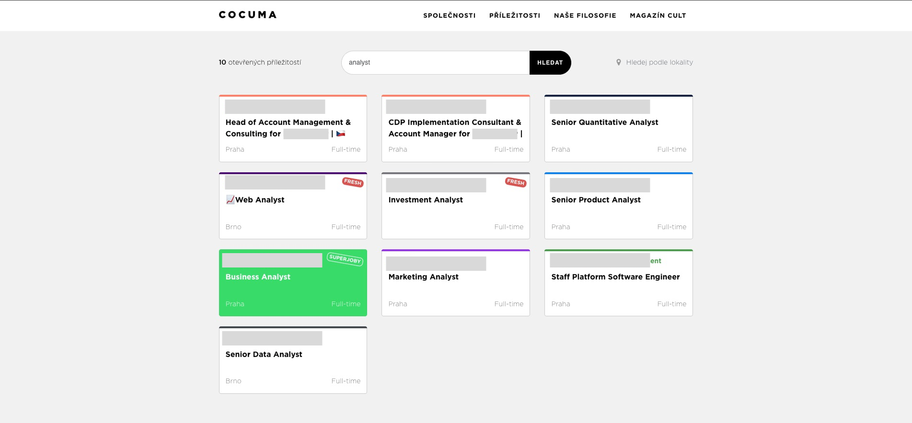

# Příležitostník

**Přesnější hledání příležitostí z [Cocuma.cz](https://www.cocuma.cz/jobs/).** Hledá pouze v **názvu pozice** a **firmě** — ne v celém popisu. Napíšete „analyst" a dostanete skutečné analytické pozice.

---

### Proč?

Cocuma.cz prohledává i popisy pozic, takže výsledky obsahují irelevantní nabídky. Například hledání „analyst" na Cocuma vrátí 10 výsledků — včetně pozic jako „Head of Account Management" nebo „Staff Platform Software Engineer", které slovo „analyst" obsahují jen někde v popisu.

Příležitostník hledá pouze v názvu pozice a firmě, takže vrátí jen 7 skutečných analytických pozic.

**Cocuma.cz** — 10 výsledků, z toho 3 irelevantní:



**Příležitostník** — 7 výsledků, všechny relevantní:


---

### Spuštění lokálně

**Dvojklik** na `run.command` (macOS). Aplikace se spustí a otevře se prohlížeč.

Nebo z terminálu:

```bash
pip install -r requirements.txt
python app.py
```

Poté otevřete **http://127.0.0.1:5000/** (aplikace to udělá za vás).

### Jak na to

1. Klikněte na **Obnovit data** pro stažení aktuálních nabídek.
2. Hledejte v poli (např. *analyst*) — výsledky se filtrují pouze podle názvu pozice a firmy.
3. Stránku můžete kdykoliv obnovit; pro čerstvá data z Cocuma klikněte znovu na **Obnovit data**.

Data se ukládají do `data/jobs.json`. Žádný účet, žádné složité URL — stačí spustit a hledat.
